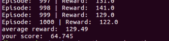
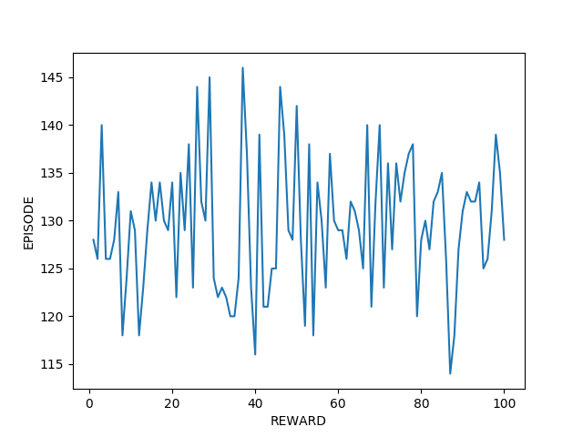
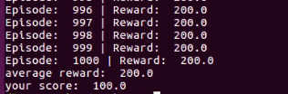
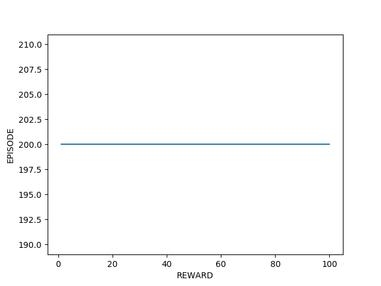

# Detials for Lab 4

## Use an Remote Desktop Application to connect to your machine

- [AnyDesk](https://anydesk.com/remote-desktop) for me
- xrdp for yours

## Run your code for training

[](http://www.youtube.com/watch?v=4Kt49E1Ir-I)

## remember to save testing log

- In this training, you will get 64.725 point 	



- Test plot like this:



You may try anthor training (if your algorithm is right but )
or modify your code.

- In this training, you will get 100 point 	



- Test plot like this:



That is what you want to see.

## Remember to save training vedios

```
MONITOR_PATH        = './vedio'       # video path
RECORD_VIDEO_FLAG   = True            # record video or not
```


